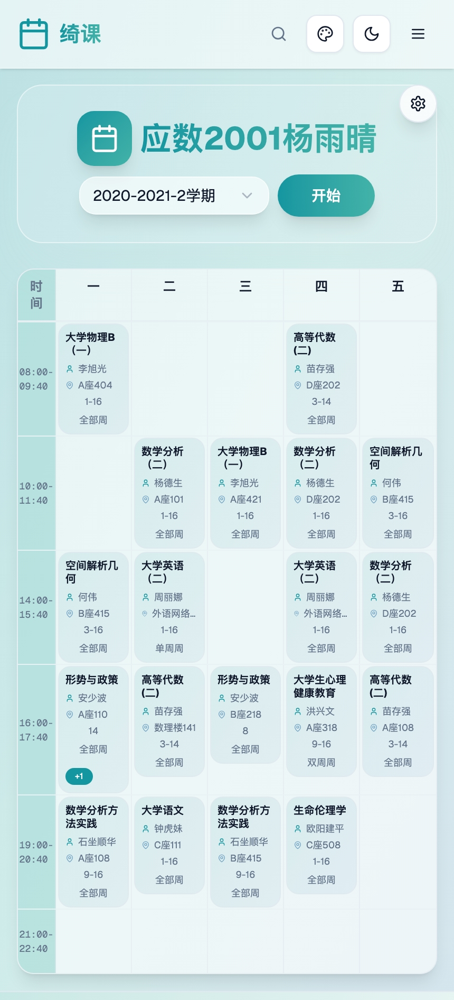

<div align="center">

# 🌸 绮课（qike.site）

<!-- 项目Logo - 您可以替换为实际的Logo图片

-->


[](https://qike.site)
[](https://github.com/huayemao/cheer-next)
[](LICENSE)
[](https://qm.qq.com/q/Z8tLiFJzCk)

**专为中南大学师生打造的课程表查询平台** ✨

[🚀 立即使用](https://qike.site) · [📊 数据发现](https://qike.site/discovery) · [📚 课程查询](https://qike.site/subjects) · [💬 反馈建议](https://qm.qq.com/q/dSso71mByM)

</div>

---

## 📖 网站简介

> 🎯 **绮课（qike.site）** 为学生、教师提供便捷的课程信息查询服务，支持学生课表、教师课表、教室课表快速查找，提供完整的课程、开课数据和优异的用户体验。

<table>
<tr>
<td>📊 <strong>9,186</strong> 门课程</td>
<td>📅 <strong>130,017</strong> 开课记录</td>
<td>📍 <strong>1,002</strong> 上课地点</td>
</tr>
</table>

### 🌟 核心特色
- 🔍 **多维度查询** - 支持学生、教师、教室、专业四种查询模式
- 📱 **响应式设计** - 完美适配手机、平板、电脑等各种设备  
- ⚡ **快速搜索** - 模糊搜索，输入部分信息即可秒查课表
- 🎨 **用户友好** - 精心设计的界面和交互体验
- 🆓 **完全免费** - 为中南大学师生提供永久免费服务

---

## ⚡ 主要功能

<details>
<summary>🔍 <strong>快速查询课表</strong></summary>

- ✅ 支持通过学号、姓名、教室、专业名称等多种方式查找课程信息
- ✅ 支持模糊搜索，输入部分信息即可秒查课表
- ✅ 查询范围涵盖学生课表、教师课表、教室课表、专业课表

</details>

<details>
<summary>🏛️ <strong>按院系浏览</strong></summary>

- 📚 可通过院系结构查找课程表
- 🎓 了解各院系专业设置及课程安排
- 📊 支持院系级别的数据统计和分析

</details>

<details>
<summary>🎯 <strong>特色服务入口</strong></summary>

- 📊 [**数据发现**](https://qike.site/discovery) - 课程数据的可视化分析与探索
- 🔍 [**课程查询**](https://qike.site/subjects) - 浏览和查询所有课程及其详细信息
- 📈 后续将添加院系数据分析和选课相关报表功能

</details>

### 🎨 界面预览

<!-- 实际截图展示区域 -->
<div align="center">

**桌面端界面**


<!-- 移动端界面展示-->
**移动端界面**
<table>
<tr>
<td></td>
<td></td>
<td></td>
</tr>
<tr>
<td align="center">首页界面</td>
<td align="center">搜索界面</td>
<td align="center">课表展示</td>
</tr>
</table>


</div>


## 🌟 特色与优势

<div align="center">

| 特色功能 | 说明 |
|:--------:|:-----|
| 📱 **响应式设计** | 完美适配手机、平板、电脑等各种设备，随时随地查看课表 |
| 🎨 **优异体验** | 精心设计的界面和交互，让查询变得轻松愉悦 |
| 📊 **数据准确** | 完整的课程、开课数据，确保信息的准确性和完整性 |
| 💯 **完全免费** | 为中南大学师生提供永久免费的课表查询服务 |

</div>

### 🛠️ 更多贴心功能

<div align="center">

| 功能 | 描述 |
|:----:|:-----|
| 🗓️ | 支持周末显示切换 |
| ⏰ | 时间/序号显示模式切换 |
| 🌙 | 深色/浅色主题支持 |
| 📖 | 课程详情一键查看 |

</div>

---

## 🚀 使用方法

<div align="center">

### 三步快速开始

</div>

```bash
# Step 1: 访问网站
🌐 打开 https://qike.site

# Step 2: 输入查询信息
🔍 在搜索框输入：学号/姓名/教室/专业名称

# Step 3: 选择查询类型并搜索  
📊 选择 [学生]/[教师]/[教室]/[专业] 并点击搜索
```

### 📱 多终端支持

<div align="center">

| 设备类型 | 支持状态 | 体验评分 |
|:--------:|:--------:|:--------:|
| 💻 **桌面端** | ✅ 完全支持 | ⭐⭐⭐⭐⭐ |
| 📱 **手机端** | ✅ 完全支持 | ⭐⭐⭐⭐⭐ |
| 📋 **平板端** | ✅ 完全支持 | ⭐⭐⭐⭐⭐ |

</div>

### 🎯 高级功能

- 🔄 **数据发现**: 通过顶部导航进入，探索课程数据可视化分析
- 📚 **课程查询**: 浏览所有课程详细信息，支持高级筛选
- 🏛️ **院系浏览**: 按院系结构查看专业设置和课程安排

---

## 👥 适用人群

<div align="center">

| 用户群体 | 使用场景 |
|:--------:|:---------|
| 🎓 **中南大学在校学生** | 查看个人课表、了解专业课程安排 |
| 👨‍🏫 **中南大学教师** | 查看教学安排、了解教室使用情况 |
| 👨‍💼 **教务管理人员** | 统计分析课程数据、管理教学资源 |
| 📋 **相关人员** | 了解课程安排、获取教学信息 |

</div>


## 使用方法

1. 访问 [https://qike.site](https://qike.site)
2. 在首页输入学号、姓名、教室或专业名称，选择查询类型，点击“搜索”即可快速获取课表信息。
3. 可通过顶部导航进入“数据发现”、“课程查询”、“按院系浏览”等特色服务。
4. 支持手机、平板、电脑等多终端访问。


## ❓ 常见问题

<details>
<summary><strong>🔍 绮课的数据来源是什么？</strong></summary>

> 📊 数据来源于中南大学教务系统，实时同步更新。
> 
> ⚠️ **重要提示**: 仅供参考，具体以[官方教务系统](http://csujwc.its.csu.edu.cn/)为准。

</details>

<details>
<summary><strong>🔐 是否需要注册/登录？</strong></summary>

> ✅ **完全免费开放** - 无需注册和登录，所有功能均可直接使用！

</details>

<details>
<summary><strong>🌐 支持哪些浏览器？</strong></summary>

> 支持所有主流浏览器：
> - ✅ Chrome (推荐)
> - ✅ Edge
> - ✅ Safari  
> - ✅ Firefox
> - ✅ 移动端浏览器

</details>

<details>
<summary><strong>🎨 如何切换主题/显示模式？</strong></summary>

> 🌙 页面右上角可切换深色/浅色主题
> 
> 📅 课表页面支持多种显示模式：
> - 时间显示 ↔️ 序号显示  
> - 显示周末 ↔️ 隐藏周末

</details>

<details>
<summary><strong>📱 移动端体验如何？</strong></summary>

> 📱 **完美适配移动端**：
> - ✅ 响应式设计，自适应屏幕尺寸
> - ✅ 触摸优化，操作流畅
> - ✅ 加载速度快，离线缓存支持

</details>

## 📞 联系方式

<div align="center">

### 🤝 联系开发者

<table>
<tr>
<td align="center">

</td>
</tr>
<tr>
<td align="center">

</td>
</tr>
</table>

### 💬 加入用户群

<table>
<tr>
<td align="center">
<strong>QQ群1</strong><br>
<br>
<a href="https://qm.qq.com/q/Z8tLiFJzCk">点击加入</a>
</td>
<td align="center">
<strong>QQ群2</strong><br>
<br>
<a href="https://qm.qq.com/q/dSso71mByM">点击加入</a>
</td>
</tr>
</table>

### 👨‍💻 开发者主页

[](https://huayemao.run/)

</div>

---

## 🔗 友情链接

<div align="center">

| 链接 | 描述 |
|:----:|:-----|
| 🌸 [**花野猫的数字花园**](https://huayemao.run/) | 开发者个人博客 |
| ✨ [**升华工作室**](https://www.54sher.com/) | 中南大学校团委网络信息部 |
| 🏛️ [**中南大学教务系统**](http://csujwc.its.csu.edu.cn/) | 官方教务管理平台 |

</div>

---

## 📜 版权声明

<div align="center">


**© 2025 绮课 (qike.site). All rights reserved.**

<blockquote>
⚠️ <strong>免责声明</strong><br>
本站数据仅供参考，不可替代中南大学教务系统，请以官方教务系统信息为准。
</blockquote>

---

<h3>🎯 用心服务每一位中南人！</h3>


<p>
<strong>喜欢这个项目吗？给我们一个 ⭐ Star 吧！</strong>
</p>

</div>